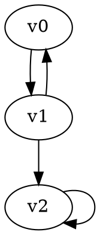

# Progressive Small Progress Measures (PSPM) Parity Game Solver

## Overview

This solver implements the Progressive Small Progress Measures algorithm for solving parity games. The PSPM algorithm is an efficient method for determining winning regions and optimal strategies in parity games by iteratively computing progress measures for each vertex.

## Algorithm Description

The Progressive Small Progress Measures algorithm works by:

1. **Initialization**: Setting up progress measures for each vertex (initially all zeros)
2. **Lift Operations**: Iteratively updating progress measures based on game structure
3. **Convergence**: Continuing until no more improvements can be made
4. **Solution Extraction**: Determining winning regions and strategies from final measures

### Key Concepts

- **Progress Measures**: Arrays that track the "progress" of each player at each vertex
- **Lift Operations**: Updates to progress measures when better moves are found
- **Convergence**: The algorithm terminates when no vertex can be "lifted" further
- **Top Element**: Special value (-1) indicating infinite progress (winning condition)

### Time and Space Complexity

- **Time**: O(n·d^(d/2)) where n is the number of vertices and d is the maximum priority
- **Space**: O(n·d) for storing progress measures and auxiliary data structures
- **Practical Performance**: Often much faster than worst-case bounds on real-world instances

## Usage

### Command Line Interface

```bash
# Solve a parity game from file
./ggg_progressive_small_progress_measures -i game.dot

# Solve from stdin with verbose output
echo "digraph G { v0 [player=0, priority=1]; }" | ./ggg_progressive_small_progress_measures -v

# Output timing information only
./ggg_progressive_small_progress_measures -i game.dot --time-only

# CSV output format
./ggg_progressive_small_progress_measures -i game.dot --csv
```

### Input Format

Parity games should be provided in DOT format with vertex attributes:
- `name`: Vertex identifier (string)
- `player`: Controlling player (0 or 1) 
- `priority`: Priority value (non-negative integer)

Example:


### Output Format

The solver outputs:
1. **Timing Information**: Algorithm execution time
2. **Solution**: For each vertex, the winning player and optimal strategy

Example output:
```
Solving time: 2.3e-04 seconds
Solution:
  start: Player 0 -> choice
  choice: Player 1 -> target  
  target: Player 0 -> target
```

## Implementation Details

### Core Data Structures

- **Progress Measures Array**: `pms[k * vertex_count]` storing measures for all vertices
- **Strategy Array**: `strategy[vertex_count]` storing optimal moves
- **Work Queue**: `todo` queue for processing vertices that need updates
- **Priority Counts**: `counts[k]` tracking vertices at each priority level

### Key Functions

- `lift(node, target)`: Attempts to improve progress measure for a vertex
- `prog(dst, src, priority, player)`: Computes updated progress measure
- `update(player)`: Global update phase for one player
- `pm_less(a, b, priority, player)`: Comparison function for progress measures

### Vertex Mapping

The algorithm internally maps between:
- **GGG Vertex Descriptors**: Boost graph vertex handles
- **Node Indices**: 0-based integer indices for array access

Functions `vertex_to_node()` and `node_to_vertex()` handle this mapping.

## Integration with GGG Framework

This solver integrates with the Game Graph Gym framework by:

- **Inheriting** from `Solver<ParityGraph, RSSolution<ParityGraph>>`
- **Implementing** the standard `solve()` interface
- **Returning** `RSSolution` with both winning regions (R) and strategies (S)
- **Using** the `GGG_GAME_SOLVER_MAIN` macro for CLI integration

## Performance Characteristics

### Strengths
- **Efficient** on many practical instances
- **Memory-friendly** compared to recursive approaches
- **Incremental** progress tracking allows early termination

### Limitations  
- **Exponential worst-case** on adversarial instances
- **Priority-dependent** performance (higher priorities → slower)
- **Not parallelizable** due to sequential lifting process

## References

1. Jurdziński, M. (2000). "Small Progress Measures for Solving Parity Games"
2. Schewe, S. (2007). "Solving Parity Games in Big Steps"
3. Fearnley, J. (2010). "Non-oblivious Strategy Improvement"

## Building and Testing

```bash
# Build the solver
cmake -S . -B build
make ggg_progressive_small_progress_measures_parity_solver

# Run basic test
echo 'digraph G { v0[player=0,priority=1]; v1[player=1,priority=0]; v0->v1; v1->v0; }' | \
  build/solvers/parity/progressive_small_progress_measures/ggg_progressive_small_progress_measures
```

The solver is automatically included in the GGG test suite and benchmark tools.
