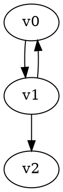

# Reachability Game Solver

This solver implements reachability games using the Parity Graph structure provided by Game Graph Gym.

## Game Definition

A **reachability game** is a two-player game where:
- **Player 0** (the protagonist) tries to reach a target vertex
- **Player 1** (the antagonist) tries to prevent Player 0 from reaching any target vertex

## Graph Representation

The solver uses the `ParityGraph` structure where:
- `vertex.player`: Owner of the vertex (0 or 1)
- `vertex.priority`: Indicates target status
  - **Priority 1**: Target vertex (Player 0 wants to reach these)
  - **Priority 0**: Non-target vertex
- `vertex.name`: Human-readable vertex identifier

## Algorithm

The solver uses an **attractor-based algorithm**:

1. **Input Validation**: Verify that all vertex priorities are 0 or 1
2. **Target Identification**: Find all vertices with priority 1 (target vertices)
3. **Attractor Computation**: Compute the attractor set `Attr₀(TARGET)` for Player 0 to all target vertices
4. **Winning Regions**: 
   - Player 0 wins all vertices in the attractor
   - Player 1 wins all remaining vertices
5. **Strategy Construction**: Extract winning strategies from the attractor computation

### Attractor Algorithm

The attractor computation uses backward reachability:
- Start with target vertices in the attractor
- Iteratively add predecessors based on player ownership:
  - **Player 0 vertex**: Add if it has at least one edge to the current attractor
  - **Player 1 vertex**: Add only if ALL outgoing edges lead to the current attractor

### Complexity

- **Time**: O(n + m) where n = vertices, m = edges
- **Space**: O(n + m) for data structures

## Usage

```bash
# Build the solver
cmake --build build --target ggg_reachability_solver

# Run on a game file
./build/solvers/parity/reachability/ggg_reachability_solver < game.dot

# With timing information
./build/solvers/parity/reachability/ggg_reachability_solver --time-only < game.dot

# CSV output for benchmarking
./build/solvers/parity/reachability/ggg_reachability_solver --csv < game.dot
```

## Input Format

The solver accepts DOT format files with the following vertex attributes:
- `player`: 0 or 1 (vertex owner)
- `priority`: 0 (non-target) or 1 (target)
- `name`: optional vertex identifier

Example:


## Output

The solver outputs:
- **Winning regions**: Which player wins each vertex
- **Strategies**: For winning vertices, the optimal move to maintain the win
- **Timing information**: Algorithm execution time (with `--time-only`)

## Integration

This solver integrates with the GGG framework:
- Uses `GGG_GAME_SOLVER_MAIN` macro for consistent CLI interface
- Returns `RSSolution<ParityGraph>` (regions + strategies)
- Supports all standard GGG benchmarking tools
