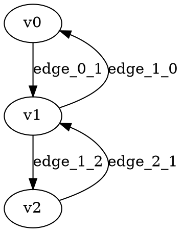

# Stochastic Discounted Games Test Suite

This directory contains a comprehensive test suite for stochastic discounted games solvers.

## Structure

The test suite consists of 150 test games organized as follows:

- **test000.dot - test014.dot**: 15 games with 10 vertices each
- **test015.dot - test029.dot**: 15 games with 20 vertices each  
- **test030.dot - test044.dot**: 15 games with 30 vertices each
- **test045.dot - test059.dot**: 15 games with 40 vertices each
- **test060.dot - test074.dot**: 15 games with 50 vertices each
- **test075.dot - test089.dot**: 15 games with 60 vertices each
- **test090.dot - test104.dot**: 15 games with 70 vertices each
- **test105.dot - test119.dot**: 15 games with 80 vertices each
- **test120.dot - test134.dot**: 15 games with 90 vertices each
- **test135.dot - test149.dot**: 15 games with 100 vertices each

## Game Properties

All games in this test suite follow these constraints:

### Structural Constraints
- **Bipartite structure**: Player vertices only connect to probabilistic vertices, and vice versa
- **No self-loops**: No vertex connects to itself
- **No player-to-player edges**: Player vertices (player 0, 1) can only connect to probabilistic vertices (player -1)
- **No stochastic-to-stochastic edges**: Probabilistic vertices can only connect to player vertices

### Vertex Requirements
- Each game has **at least 1 probabilistic vertex** (player=-1)
- Each game has **at least 1 player vertex** (player=0 or 1)  
- Each vertex has **at least 1 outgoing edge**

### Edge Properties
- **Player vertex edges**: Have `weight` (range: -10.0 to 10.0) and `discount` (range: 0.1 to 0.9) attributes
- **Probabilistic vertex edges**: Have `probability` attributes that sum exactly to 1.0 for each vertex
- All probabilities are in range (0.0, 1.0]
- All discount factors are in range (0.0, 1.0)

## File Format

Games are stored in DOT (Graphviz) format with the following structure:

## Validation

All 150 games in this test suite have been validated to:
- Parse correctly with the stochastic discounted graph parser
- Pass the `is_valid()` function requirements
- Run successfully on all stochastic discounted solvers:
  - `stochastic_discounted_strategy_solver`
  - `stochastic_discounted_objective_solver` 
  - `stochastic_discounted_value_solver`

## Usage

These games can be used for:
- **Performance benchmarking** of stochastic discounted solvers
- **Correctness testing** by comparing solver outputs
- **Regression testing** to ensure solver implementations remain correct
- **Algorithm validation** for new solver implementations

## Generation

This test suite was generated using `generate_simple_stochastic_test_suite.py` with seed 12345 for reproducibility.

The generator ensures all structural constraints are met by design, creating simple but valid bipartite game structures that exercise the key features of stochastic discounted games while maintaining mathematical validity.
